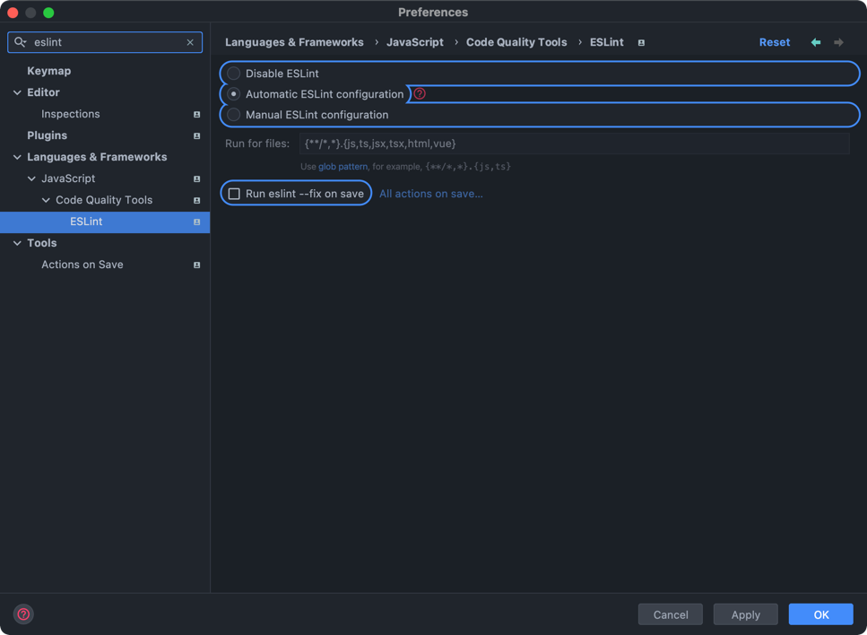
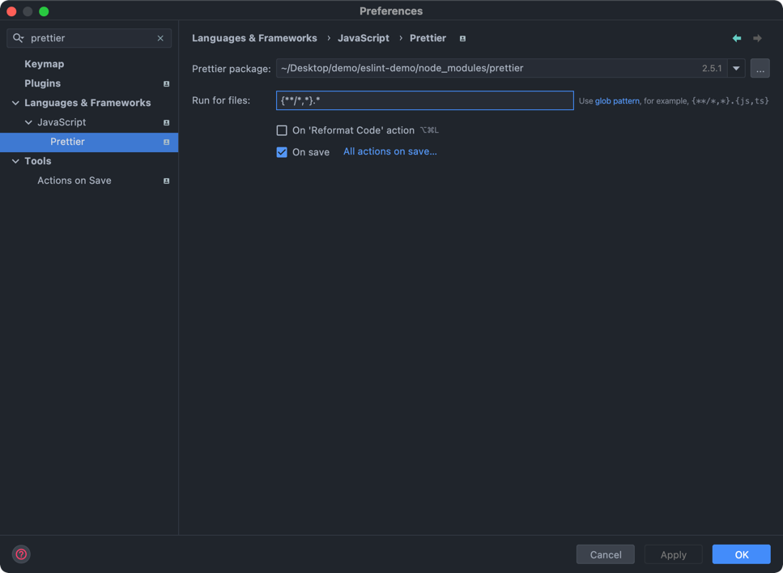

## 前言

编码层面的格式化是编码的基础，能有效的减少代码错误率和，美化代码使代码更容易维护和交接。  
目前我接触到的编程层面规范有以下几种：  

- 代码规范检查与美化 [Eslint](https://eslint.org/) + [Prettier](https://prettier.io/)
- git提交日志规范
- 版本更新日志规范
- 代码合并review

## 代码规范检查与美化

### 依赖安装

```shell
# 基本依赖
pnpm i eslint prettier eslint-config-prettier eslint-plugin-prettier -D
# 使用TypeScript 需要增加依赖
pnpm i typescript @typescript-eslint/eslint-plugin @typescript-eslint/parser -D
```

### rc配置

#### 纯JavaScript版本

_.eslintrc_
```json5
{
  "root": true,
  "plugins": ["prettier"],
  "extends": [
    "eslint:recommended",
    "prettier"
  ],
  "rules": {
    "prettier/prettier": "error",
    "arrow-body-style": "off",
    "prefer-arrow-callback": "off"
  }
}
```

_.prettierrc_
```json5
{
  "semi": true, // 使用分号
  "singleQuote": true // 单引号
}
```

#### TypeScript 版本

_.eslintrc_
```json5
{
  "root": true,
  "parser": "@typescript-eslint/parser",
  "plugins": ["@typescript-eslint","prettier"],
  "extends": [
    "eslint:recommended",
    "plugin:@typescript-eslint/eslint-recommended",
    "plugin:@typescript-eslint/recommended",
    "prettier"
  ],
  "rules": {
    "prettier/prettier": "error",
    "arrow-body-style": "off",
    "prefer-arrow-callback": "off"
  }
}
```

_.prettierrc_
```json5
{
  "semi": true, // 使用分号
  "singleQuote": true // 单引号
}
```

### 配置编辑器插件

因为配置中eslint使用prettier的配置进行校验，所以在编辑器中，直接使用prettier进行格式化代码即可。

#### VsCode

_setting.json_
```json5
{
  "editor.defaultFormatter": "esbenp.prettier-vscode", // 将VsCode默认格式化程序
  "editor.formatOnSave": true // 保存时格式化
}
```
#### WebStorm

1. ``` command + , ``` 打开设置页面
2. 搜索 ```eslint```，选择自动配置

3. 搜索 ```prettier```，默认会选择最近的prettier路径，然后

